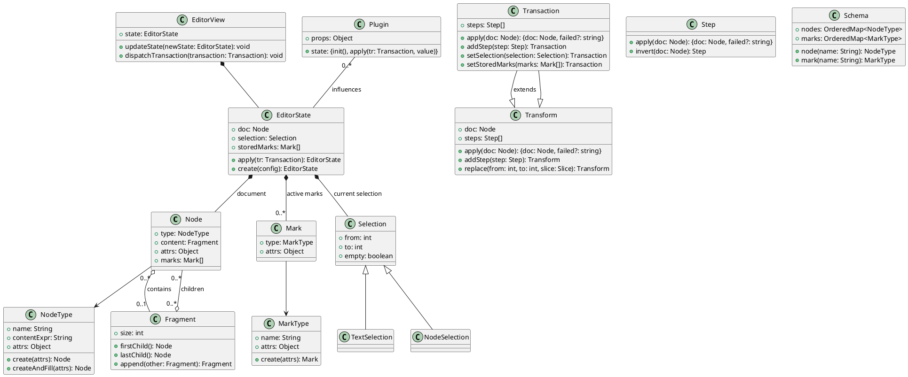
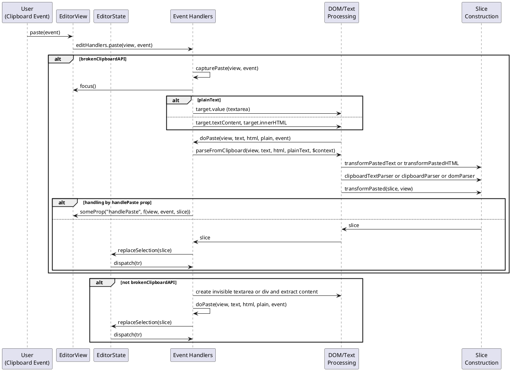

ProseMirror is a toolkit for building rich-text editors on the web. It is highly customizable and extensible, and it is designed to work well with other tools and frameworks. This guide will help you understand the architecture of ProseMirror and how to use it in practice.

Based on the documents below: 

- [Library Design Guide](https://prosemirror.net/docs/guide/)
- [Library Reference](https://prosemirror.net/docs/ref/)

This article will use problem and scenario-based examples to help you understand the architecture of ProseMirror and how to use it in practice.

> based on source code version: `1.33.4`

## General Architecture

> Suppose you have already read the Design Guide and have a general understanding of ProseMirror.





## Scenario Driven Digging

### How ProseMirror handle clipboard paste?

From the API doc we can see there are several related API to handle paste related operation

* `view.pasteHTML()`: Run the editor's paste logic with the given HTML string.  
* `view.pasteText()`: Run the editor's paste logic with the given plain text string.
* `view.props.handlePaste`: Can be used to override the behavior of pasting. slice is the pasted content parsed by the editor, but you can directly access the event to get at the raw content.
* `view.props.transformPasted`: Can be used to transform pasted or dragged-and-dropped content before it is applied to the document.
* `view.props.transformPastedHTML: fn -> string`: Can be used to transform pasted HTML text, before it is parsed, for example to clean it up.
* `view.props.transformPastedText: fn -> string`: Can be used to transform pasted plain text, before it is parsed, for example to clean it up.
* `view.props.clipboardParser: fn -> DomParser`: The parser to use when reading content from the clipboard. When not given, the value of the domParser prop is used.
* `view.props.clipboardTextParser⁠`: A function to parse text from the clipboard into a document slice. Called after transformPastedText. The default behavior is to split the text into lines, wrap them in <p> tags, and call clipboardParser on it. The plain flag will be true when the text is pasted as plain text.


### Detail of paste process in source code


* invocation sequence can be shown here:
  * entry: `prosemirror-view/src/input.ts`: this 
  * core method of handling entry point of paste is `doPaste()`

```ts
editHandlers.paste = (view, _event) => {
  let event = _event as ClipboardEvent
  // Handling paste from JavaScript during composition is very poorly
  // handled by browsers, so as a dodgy but preferable kludge, we just
  // let the browser do its native thing there, except on Android,
  // where the editor is almost always composing.
  if (view.composing && !browser.android) return
  let data = brokenClipboardAPI ? null : event.clipboardData
  let plain = view.input.shiftKey && view.input.lastKeyCode != 45
  if (data && doPaste(view, getText(data), data.getData("text/html"), plain, event))
    event.preventDefault()
  else
    capturePaste(view, event)
}

export function doPaste(view: EditorView, text: string, html: string | null, preferPlain: boolean, event: ClipboardEvent) {
  let slice = parseFromClipboard(view, text, html, preferPlain, view.state.selection.$from)
  if (view.someProp("handlePaste", f => f(view, event, slice || Slice.empty))) return true
  if (!slice) return false

  let singleNode = sliceSingleNode(slice)
  let tr = singleNode
    ? view.state.tr.replaceSelectionWith(singleNode, preferPlain)
    : view.state.tr.replaceSelection(slice)
  view.dispatch(tr.scrollIntoView().setMeta("paste", true).setMeta("uiEvent", "paste"))
  return true
}

function capturePaste(view: EditorView, event: ClipboardEvent) {
  if (!view.dom.parentNode) return
  let plainText = view.input.shiftKey || view.state.selection.$from.parent.type.spec.code
  let target = view.dom.parentNode.appendChild(document.createElement(plainText ? "textarea" : "div"))
  if (!plainText) target.contentEditable = "true"
  target.style.cssText = "position: fixed; left: -10000px; top: 10px"
  target.focus()
  let plain = view.input.shiftKey && view.input.lastKeyCode != 45
  setTimeout(() => {
    view.focus()
    if (target.parentNode) target.parentNode.removeChild(target)
    if (plainText) doPaste(view, (target as HTMLTextAreaElement).value, null, plain, event)
    else doPaste(view, target.textContent!, target.innerHTML, plain, event)
  }, 50)
}

// Read a slice of content from the clipboard (or drop data).
export function parseFromClipboard(view: EditorView, text: string, html: string | null, plainText: boolean, $context: ResolvedPos) {
  let inCode = $context.parent.type.spec.code
  let dom: HTMLElement | undefined, slice: Slice | undefined
  if (!html && !text) return null
  let asText = text && (plainText || inCode || !html)
  if (asText) {
    view.someProp("transformPastedText", f => { text = f(text, inCode || plainText, view) })
    if (inCode) return text ? new Slice(Fragment.from(view.state.schema.text(text.replace(/\r\n?/g, "\n"))), 0, 0) : Slice.empty
    let parsed = view.someProp("clipboardTextParser", f => f(text, $context, plainText, view))
    if (parsed) {
      slice = parsed
    } else {
      let marks = $context.marks()
      let {schema} = view.state, serializer = DOMSerializer.fromSchema(schema)
      dom = document.createElement("div")
      text.split(/(?:\r\n?|\n)+/).forEach(block => {
        let p = dom!.appendChild(document.createElement("p"))
        if (block) p.appendChild(serializer.serializeNode(schema.text(block, marks)))
      })
    }
  } else {
    view.someProp("transformPastedHTML", f => { html = f(html!, view) })
    dom = readHTML(html!)
    if (browser.webkit) restoreReplacedSpaces(dom)
  }

  let contextNode = dom && dom.querySelector("[data-pm-slice]")
  let sliceData = contextNode && /^(\d+) (\d+)(?: -(\d+))? (.*)/.exec(contextNode.getAttribute("data-pm-slice") || "")
  if (sliceData && sliceData[3]) for (let i = +sliceData[3]; i > 0; i--) {
    let child = dom!.firstChild
    while (child && child.nodeType != 1) child = child.nextSibling
    if (!child) break
    dom = child as HTMLElement
  }

  if (!slice) {
    let parser = view.someProp("clipboardParser") || view.someProp("domParser") || DOMParser.fromSchema(view.state.schema)
    slice = parser.parseSlice(dom!, {
      preserveWhitespace: !!(asText || sliceData),
      context: $context,
      ruleFromNode(dom) {
        if (dom.nodeName == "BR" && !dom.nextSibling &&
            dom.parentNode && !inlineParents.test(dom.parentNode.nodeName)) return {ignore: true}
        return null
      }
    })
  }
  if (sliceData) {
    slice = addContext(closeSlice(slice, +sliceData[1], +sliceData[2]), sliceData[4])
  } else { // HTML wasn't created by ProseMirror. Make sure top-level siblings are coherent
    slice = Slice.maxOpen(normalizeSiblings(slice.content, $context), true)
    if (slice.openStart || slice.openEnd) {
      let openStart = 0, openEnd = 0
      for (let node = slice.content.firstChild; openStart < slice.openStart && !node!.type.spec.isolating;
           openStart++, node = node!.firstChild) {}
      for (let node = slice.content.lastChild; openEnd < slice.openEnd && !node!.type.spec.isolating;
           openEnd++, node = node!.lastChild) {}
      slice = closeSlice(slice, openStart, openEnd)
    }
  }

  view.someProp("transformPasted", f => { slice = f(slice!, view) })
  return slice
}
```





* copy process is similar to paste, but with different API and behavior, you can refer to the API doc for more details.

Now we can see the whole process of paste event handling in ProseMirror, and how it is implemented in the source code. The interesting part here is:

* `capturePaste` method is used to handle the paste event when the clipboard API is broken. It creates a hidden textarea or div element to capture the pasted content and then calls `doPaste` method to handle the pasted content.
* `view.input.shiftKey && view.input.lastKeyCode != 45` is used to determine if the pasted content is plain text with shift key pressed.

## More Scenarios

🚧 Work in progress ...

